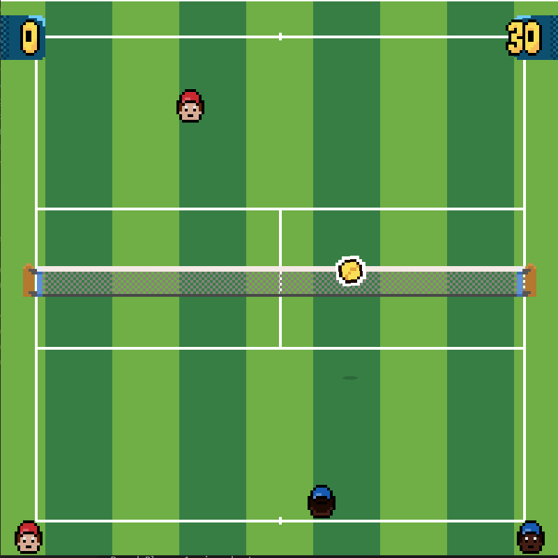

# Tennis Game

This project is a simplified version of a tennis game where you can play against a basic AI or local multiplayer.

## Features

- **Human-controlled Player**: Control player 1 using the keyboard.
- **AI-controlled Player**: The second player is controlled by a simple AI, which tracks the ball.
- **Tennis Mechanics**: Swing the racket, hit the ball, and try to score points following basic tennis rules.
- **Collision Detection**: Includes detection for the ball going out of bounds and hitting the net.
- **Multiplayer Support**: Play against a friend on the same network.


## Controls

- **W**: Move player up.
- **S**: Move player down.
- **A**: Move player left.
- **D**: Move player right.
- **Space Bar**: Swing the racket.

## Installation

1. Make sure you have `pygame` installed:

   ```
   pip install pygame
   ```

2. Clone this repository and navigate into the project directory:

   ```
   git clone <repository-url>
   cd single-player-tennis
   ```

3. Run the game:

   ```
   python game.py
   ```

## The game is now running!


## Game Files

- `game.py`: The main game loop and logic for running the single-player mode.
- `player.py`: Contains the `Player` class, handling player movement and actions.
- `ball.py`: Contains the `Ball` class, handling ball movement and collision detection.
- `net.py`: Contains the `Net` class, for representing the net in the middle of the court.
- `settings.py`: Configuration for the game's screen width, height, and other constants.
- `network_manager.py`: Contains the `NetworkManager` class, handling network connections and messages.

## Future Improvements

- Implement more advanced AI with different difficulty levels.
- Add sound effects and music for a more immersive experience.
- Add animations for player movement and ball hitting.
